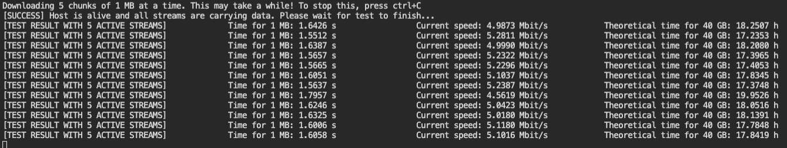
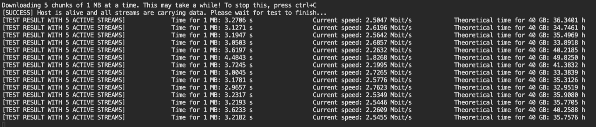

# ESP32 ESP8266 TCP Socket Speed Test
 Measures the usable data-thoughput from the ESP to the computer.

Copyright Julius Kramer 2020

TCP Socket Speed Test for ESP32 / ESP8266
The counterpart software has to be installed on the ESP target.
Using this script, the usable data-thoughput from the ESP to the computer can be measured.
Depending on network speeds (and ESP clock speed) this test may take a couple of minutes. 

# Note

:bangbang: Regarding ESP8266, no limit of streams is known (testet and could handle easily 100+ streams)

:bangbang: Regarding ESP32, 5 concurrent streams is the MAXIMUM!

# Sample result for ESP32 (5 concurrent streams)


# Sample result for ESP8266 (5 concurrent streams)


# Usage
Download "Platform IO" and load either the esp32 or ep8266 program (depending on your device) onto the device. Make sure it is connected to the network by using a serial monitor: the program will tell you its IP address as soon as it connected successfully. :bangbang: In my tests i had to reset the esp32 a couple of times to get it connected, this is assumed an esp32 error because this procedure was not necessary on the esp8266.
Once the network connection is established, change the ip address in the python script and run the script. After around 30 seconds you should see the speedtest results. 

You can specify how many concurrent connections you want to test by changing the parameter in the configuration section:
```python
"""
CONFIGURATION
"""
# ESP IP in local network
host = "192.168.100.39"

# Regarding ESP32, 5 concurrent streams is the MAXIMUM!
# Regarding ESP8266, no limit of streams is known (testet and could handle easily 100+ streams)
concurrent_connections = 5
```